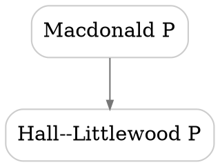

# Relation Posets Plan

This file plans how to turn `polydata` relation rows into posets and render them as SVG diagrams.

## Current Relation Data

Relations are encoded inside `polydata` blocks:

```tex
\begin{polydata}{macdonaldP}
  Name       & Macdonald P polynomials \\
  Space      & Sym \\
  Rating     & 4 \\
  Year       & 1987 \\
  Generalizes & hallLittlewoodP | Macdonald1987 \\
  Generalizes & jackP \\
  PositiveIn  & schur | SomeBibKey \\
\end{polydata}
```

Multiple rows with the same relation key are allowed. They accumulate:

```tex
  Generalizes & schur \\
  Generalizes & hallLittlewoodP | Macdonald1987 \\
  Generalizes & jackP \\
```

Multiple targets on one row are also allowed:

```tex
  Generalizes & schur; hallLittlewoodP | Macdonald1987; jackP \\
```

After `gather.lua` and `merge_meta.lua`, each relation appears in `temp/site-polydata.json` as:

```json
{
  "type": "generalizes",
  "label": "Generalizes",
  "target": "schur",
  "ref": "SomeBibKey"
}
```

The three canonical relation types are:

| TeX key | Internal type | Intended reading |
| --- | --- | --- |
| `Generalizes` | `generalizes` | source family generalizes target family |
| `Contains` | `contains` | source family contains target family as a subfamily/subcase |
| `PositiveIn` | `positive_in` | source family expands positively in target family |

The long keys from the first draft can remain aliases, but new data should prefer these shorter keys.

## Broader Relation Vocabulary

The larger goal is not just three posets, but a structured relation layer for
families of symmetric functions and related polynomial families. These
relations should be encoded in the `polydata` block of the source family. The
website should not keep a separate hand-written relation database unless it is
generated from `polydata`.

The first implementation should stay conservative and keep the three existing
relation types above working well. The next design step is a relation registry,
so new relations are added deliberately instead of hard-coded one at a time in
`gather.lua` and `merge_meta.lua`.

Useful relation types to support include:

| TeX key | Internal type | Intended reading | Render as |
| --- | --- | --- | --- |
| `PositiveIn` | `positive_in` | source expands positively in target | poset/DAG |
| `Generalizes` | `generalizes` | source generalizes target | poset/DAG |
| `Contains` | `contains` | source contains target as a subfamily or subcase | poset/DAG |
| `SpecializesTo` | `specializes_to` | source specializes to target after a parameter value, limit, or substitution | poset/DAG |
| `DegeneratesTo` | `degenerates_to` | source degenerates or limits to target | poset/DAG |
| `KTheoreticAnalogueOf` | `k_theoretic_analogue_of` | source is a K-theoretic lift or analogue of target | relation graph, not a poset |
| `StableLimit` | `stable_limit` | source has target as its stable limit | directed graph |
| `SignedIn` | `signed_in` | source expands in target with a predictable sign rule | directed graph, not positive |
| `TransformsTo` | `transforms_to` | source is obtained from target, or vice versa, by a named transform | relation graph, not a poset |
| `DualTo` | `dual_to` | source is dual to target under a specified pairing or involution | undirected/directed graph, not a poset |
| `NSymQSymDual` | `nsym_qsym_dual` | source and target are dual under the NSym/QSym pairing | relation graph, not a poset |
| `Refines` | `refines` | source carries extra data whose forgetting gives target | directed graph, sometimes poset |

The basic direction convention is that arrows point from the more general,
structured, or source family to the more specific family obtained from it. For
example:

```text
key -> schur                  via Generalizes
schubert -> schur             via Contains
macdonaldE -> key             via SpecializesTo
llt -> schur                  via PositiveIn, when the Schur expansion is positive
```

Thus `Generalizes`, `Contains`, `SpecializesTo`, `DegeneratesTo`, and
`PositiveIn` are all intended as poset-type relations. In practice the builder
should still detect cycles. A cycle might indicate bad data, or it might mean
that two ids are equivalent for that relation and should eventually be
collapsed into one component.

The exact list can grow, but each relation should have explicit metadata:

- TeX keys and aliases;
- internal slug;
- human-readable label;
- direction convention;
- whether it should be treated as transitive;
- whether cycles are errors, warnings, or expected equivalences;
- whether a Hasse diagram makes sense;
- whether edge annotations are required;
- whether a bibliography entry is required.

Every asserted relation edge should have at least one bibliography key. The
point is that the relation layer should be auditable: when a page says, for
example, that one family specializes to another or expands positively in
another, the data should identify a source for that assertion. If no source is
known yet, the edge should remain in notes rather than entering `polydata`.

Relation edges should also carry a status. The default status is `theorem`, but
`conjecture` should be supported explicitly. This lets the site show conjectural
edges without mixing them silently with proved relations.

## Metadata Convention

There are two levels of metadata.

Family metadata describes one polynomial family. It stays in ordinary
`polydata` key-value rows:

```tex
\begin{polydata}{key}
  Name     & Key polynomials \\
  Symbol   & $\key_\alpha(\xvec)$ \\
  Space    & All \\
  Basis    & True \\
  Rating   & 5 \\
  Bib      & Demazure1974nouvelle \\
  Year     & 1974 \\
  Keywords & divided-difference, demazure \\
\end{polydata}
```

Relation metadata describes one directed edge from the source `polydata` id to
another `polydata` id. The source is the id of the current block. The target
must be another current `polydata` id.

The proposed row grammar is:

```text
RelationKey & target | BibKey[,BibKey...] | attr=value; attr=value \\
```

The bibliography field is mandatory in final source rows. It may contain
several comma-separated BibTeX keys. The attribute field is optional.
Attributes use lower snake case keys. Values are trimmed strings and should not
contain `|` or `;`.

Examples:

The examples below focus on relation rows and omit some ordinary required
family fields for brevity.

```tex
\begin{polydata}{macdonaldE}
  Name          & Macdonald E polynomials \\
  SpecializesTo & key | RamYip2011 | map=q=t=0 \\
  StableLimit   & macdonaldP | Macdonald1987 | map=symmetrization \\
\end{polydata}

\begin{polydata}{lascoux}
  Name                 & Lascoux polynomials \\
  KTheoreticAnalogueOf & key | Lascoux2001 | parameter=beta \\
  PositiveIn           & lascouxAtom | Lascoux2004 | status=conjecture \\
\end{polydata}

\begin{polydata}{LLT}
  Name       & LLT polynomials \\
  PositiveIn & schurS | Lascoux97ribbontableaux | combinatorial_rule=none_known \\
\end{polydata}
```

Rows with attributes should use one target per row. Semicolon-separated targets
can remain as a shorthand only when all targets have exactly the same
references and no attributes.

### Common Attributes

These attributes are valid on any relation row:

| Attribute | Meaning |
| --- | --- |
| `status=theorem` | proved relation, default if omitted |
| `status=conjecture` | conjectural relation |
| `status=question` | stated as a question or plausible relation, hidden by default |
| `scope=...` | hypotheses or indexing restrictions, such as `Grassmannian` |
| `note=...` | short display or machine-readable note |
| `include=false` | migration-only flag; do not render by default |

The `status` field records truth status only. It should not be used for
information such as "no combinatorial rule is known". Use a relation-specific
attribute for that.

### Relation-Specific Attributes

Use relation-specific attributes when the edge needs mathematical detail:

| Attribute | Typical relations | Meaning |
| --- | --- | --- |
| `map=...` | `SpecializesTo`, `DegeneratesTo`, `StableLimit`, `TransformsTo` | specialization, limit, or transform, such as `q=0`, `t=1`, `beta=0`, `omega`, or `plethysm` |
| `parameter=...` | `KTheoreticAnalogueOf`, `SpecializesTo` | relevant deformation parameter |
| `semiring=...` | `PositiveIn`, `SignedIn` | coefficient semiring, such as `NN`, `NN[q]`, or `NN[q,t]` |
| `sign_rule=...` | `SignedIn` | sign convention for a signed expansion |
| `combinatorial_rule=known` | `PositiveIn` | a positive combinatorial expansion is known |
| `combinatorial_rule=none_known` | `PositiveIn` | positivity is known, but no combinatorial rule is recorded |
| `proof=...` | any relation | optional proof style, such as `combinatorial`, `geometric`, or `algebraic` |
| `pairing=...` | `DualTo`, `NSymQSymDual` | pairing or involution defining the duality |

For example, the legacy status `NoCombinatorial` should become
`combinatorial_rule=none_known`, not `status=no_combinatorial`.

### Relation JSON Shape

After parsing, relation rows should normalize to records of this form:

```json
{
  "source": "macdonaldE",
  "target": "key",
  "type": "specializes_to",
  "label": "SpecializesTo",
  "refs": ["RamYip2011"],
  "status": "theorem",
  "attrs": {
    "map": "q=t=0"
  },
  "source_loc": "tex-source/macdonaldE.tex:7"
}
```

For backward compatibility, renderers can continue accepting a scalar `ref`
field during the transition. New generated data should prefer `refs`.

### Relation Registry

Relation behavior should live in one registry used by both `gather.lua` and
`merge_meta.lua`. Each entry should specify:

- accepted TeX keys and aliases;
- internal slug;
- display label;
- direction convention;
- whether the relation is transitive;
- whether it is a poset/DAG relation;
- whether refs are required;
- allowed statuses;
- allowed or expected attributes;
- render style for theorem, conjecture, and question edges.

For example, `KTheoreticAnalogueOf` should not be collapsed into the
generalization poset. Lascoux polynomials being a K-theoretic analogue of key
polynomials is useful data, but it is more like a typed edge in a neighborhood
graph than a cover relation in a poset.

The intended source-of-truth rule is:

- each polynomial-family page owns the outgoing relation rows for its
  `polydata` entries;
- generated JSON files, relation tables, graph views, and poset diagrams are
  derived from those rows;
- if the same mathematical relation is mentioned in prose, the corresponding
  structured row should also appear in `polydata` once the relation type is
  supported;
- each asserted relation row should include a bibliography key and should be
  marked `status=conjecture` if it is not proved;
- implementation code may normalize aliases, validate targets, and compute
  closures, but should not introduce additional mathematical assertions that do
  not appear in source `polydata`.

## Legacy Seed Data

There are three older relation-data files in `untracked/`:

- `untracked/polynomialData.m`;
- `untracked/tikzdataRelations.txt`;
- `untracked/tikzdataPositivity.txt`.

The primary legacy source is `polynomialData.m`. It contains the polynomial
family records and the original edge list, sometimes with `Link`, `Bib`,
`Status`, `Comment`, or `Map` metadata. The two `tikzdata*` files are useful as
rendered-diagram snapshots, but they should be treated as derived or partial
views of the older data.

These files contain useful seed data, but they should not be imported directly.
The TikZ files mix node layout, display labels, and mathematical relation
assertions. The Mathematica file has richer edge metadata, but its ids and
relation names still need to be normalized. For the new system, each imported
edge still needs:

- current `polydata` ids;
- a supported relation type;
- at least one bibliography key;
- a status, with `theorem` as default and `conjecture` when appropriate;
- an edge map when needed, for example `map=q=0` or `map=beta=0`.

The legacy relation keys should be migrated as follows:

| Legacy key | New relation |
| --- | --- |
| `SpecializesTo` | `SpecializesTo` |
| `SupersetOf` | `Contains` |
| `StableLimit` | `StableLimit` |
| `KAnalogueOf` | `KTheoreticAnalogueOf` |
| `ExpandsPositiveIn` | `PositiveIn` |
| `ExpandsSignedIn` | keep separate from `PositiveIn`; add a signed-expansion relation only if needed |
| `Misc` | do not import without reclassifying manually |
| `NSymQSymDual` | keep separate; likely a duality relation, not a poset edge |

Current counts in the edge list of `polynomialData.m`, after ignoring
commented-out edges:

| Legacy key | Edges |
| --- | ---: |
| `ExpandsPositiveIn` | 77 |
| `ExpandsSignedIn` | 3 |
| `KAnalogueOf` | 5 |
| `Misc` | 9 |
| `NSymQSymDual` | 2 |
| `SpecializesTo` | 35 |
| `StableLimit` | 8 |
| `SupersetOf` | 33 |

The legacy TikZ files contain a smaller rendered subset:

| Legacy key | Edges |
| --- | ---: |
| `ExpandsPositiveIn` | 60 |
| `ExpandsSignedIn` | 3 |
| `KAnalogueOf` | 5 |
| `Misc` | 8 |
| `SpecializesTo` | 33 |
| `StableLimit` | 8 |
| `SupersetOf` | 26 |

Metadata migration rules:

| Legacy metadata | New meaning |
| --- | --- |
| `"Link" -> ...` | convert to a bibliography entry and store the resulting BibTeX key in `refs` |
| `"Bib" -> ...` | use as the bibliography key, after checking it exists in `bibliography.bib` |
| `"Status" -> "Conjecture"` | store `status=conjecture` |
| `"Status" -> "NoCombinatorial"` | store `combinatorial_rule=none_known`; verify the truth status before import |
| `"Comment" -> ...` | preserve as `note=...` if short, otherwise move to prose or a migration note |
| `"Map" -> ...` | preserve as `map=...` for specialization edges |

The migration should prefer edges in `polynomialData.m` over the TikZ files
whenever they disagree, because `polynomialData.m` is closer to the original
data source and contains references or status information on some relations.
However, the final source of truth must still be the `polydata` blocks in the
TeX pages. A migration script should generate candidate `polydata` rows or a
review table; it should not introduce assertions directly into generated JSON.

Several legacy ids need to be mapped to current `polydata` ids before import:

| Legacy id | Current id |
| --- | --- |
| `completeHomogeneous` | `completeH` |
| `doubleGrothendieck` | `grothendieckDouble` |
| `doubleSchubert` | `schubertDouble` |
| `factorialSchur` | `schurFactorial` |
| `flaggedSkewSchur` | `schurFlagged` |
| `fundamentalSlide` | `slideF` |
| `generalAtom` | `generalizedDemazureAtoms` |
| `grothendieckDual` | `grothendieckDualStable` |
| `grothendieckGrassman` | `grothendieckGrassmann` |
| `modHL` | `hallLittlewoodH` |
| `monomialSlide` | `slideM` |
| `permBasMacdonaldE` | `macdonaldEperm` |
| `quasiMonomial` | `qmonom` |
| `quasiPower1` | `qPsi` |
| `quasiPower2` | `qPhi` |
| `quasiSchur` | `qSchur` |
| `quasiSchurYoung` | `yqSchur` |
| `rowStricSchur` | `rsqSchur` |
| `schurExtended` | `extSchur` |
| `shiftedJack` | `jackShifted` |
| `shiftedSchur` | `schurShifted` |

Some legacy ids do not currently have an obvious `polydata` target, or need a
mathematical decision before migration. Examples include `doubleSchur`,
`fundamentalParticle`, `kohnertQuasi`, `monomialNonsymmetric`, `nonSymElem`,
`nonSymqElem`, and the noncommutative power-sum and complete homogeneous ids.
These should either get new `polydata` entries or be omitted from the first
migration pass.

## Poset Semantics

Each poset-like relation type should be treated as a separate transitive
relation. Do not merge the relation types into one global poset by default,
since the meanings are different.

For a relation item on family `A` with target `B`, create a directed relation:

```text
A --type--> B
```

Interpretation:

```text
A >=_type B
```

For `Generalizes`, `Contains`, `SpecializesTo`, and `DegeneratesTo`, this puts
more general/larger families above more special/smaller families. For
`PositiveIn`, this puts the family being expanded above the family used as the
positive expansion basis/container. The SVG can show arrows downward from
source to target, or omit arrowheads and rely on vertical order.

For relation types marked as transitive:

```text
A >= B and B >= C implies A >= C
```

The rendered diagram should be the Hasse diagram: show only cover relations, not every implied transitive edge.

For non-poset relations, the builder should skip transitive reduction and render
typed directed neighborhoods or relation graphs instead.

## Core Algorithm

Create a Lua module/script, probably `polydata_posets.lua`, that reads `temp/site-polydata.json` and emits both machine-readable graph data and SVG files.

Inputs:

- `temp/site-polydata.json`
- optionally `temp/bibliography.json`, only if edge tooltips or reference labels are wanted

Outputs:

- `temp/site-posets.json`: normalized graph data for all relation types
- `assets/svg-images/poset-generalizes.svg`
- `assets/svg-images/poset-contains.svg`
- `assets/svg-images/poset-positive-in.svg`
- later, optional filtered SVGs such as `poset-generalizes-schur.svg`

Steps:

1. Load all polydata entries.
2. Build a node table keyed by polydata id, with display fields:
   - `id`
   - `Name`
   - `Space`
   - `Category`
   - `page`
   - `href`
3. Build an asserted edge list for each relation type:
   - `source`
   - `target`
   - `type`
   - `refs`
   - `status`, defaulting to `theorem`
   - `attrs`, including `map`, `note`, `scope`, and other attributes
   - `asserted = true`
4. Validate edges:
   - target id exists
   - bibliography key exists and is nonempty
   - status is one of the supported values, initially `theorem`,
     `conjecture`, or `question`
   - no self-loop unless explicitly allowed
   - no duplicate asserted edge with conflicting refs without warning
5. Detect cycles per relation type.
   - A cycle means the data is not a poset.
   - For a first implementation, fail the build on cycles.
   - Later, support alias components if we intentionally want equivalence classes.
6. Compute transitive closure per relation type.
   - Use DFS from each node; the graph is small enough.
   - Store closure for validation and future search/filtering.
7. Compute transitive reduction per relation type.
   - For each asserted or closure edge `A -> B`, remove it from the rendered edge set if there exists a path `A -> ... -> B` of length at least two.
   - The remaining edges are the Hasse cover relations.
8. Rank nodes.
   - Minimal simple rule: rank by longest path to a sink, so targets/specializations land lower.
   - Isolated nodes may be omitted by default or collected in a separate row.
9. Render SVG.

## SVG Rendering Strategy

Preferred first implementation: use Graphviz `dot` to produce SVG.

Reasons:

- Hasse diagrams are directed acyclic graphs; `dot` is good at layered DAG layout.
- It handles edge routing, text sizing, and rank constraints better than a quick custom renderer.
- The repo already has generated SVG assets and a build pipeline where another generated asset step is natural.

Tradeoff:

- Adds `dot`/Graphviz as a build dependency.

If avoiding a dependency becomes important, write a simple internal SVG renderer later:

- rank by longest path;
- group nodes by rank;
- order each rank alphabetically or by barycenter from adjacent ranks;
- draw straight or cubic edges;
- output pure SVG with text labels.

Graphviz DOT shape sketch:



SVG output from Graphviz preserves links with `href`/`URL` attributes depending on the Graphviz version. Verify the generated SVG links work after copying to `www/svg-images/`.

## Site Integration

There are two useful display modes.

### Static Index Diagrams

Add pages or sections that show the full posets:

```tex
\svgimg[width=0.95\textwidth]{svg-images/poset-generalizes.svg}{Generalization poset of polynomial families.}
```

These can live on `polynomialList.tex` or a new page such as `polynomialRelations.tex`.

### Dynamic Special Blocks

Later, add special blocks:

```tex
\specialblock{relationPoset:generalizes}
\specialblock{relationPoset:contains}
\specialblock{relationNeighborhood:macdonaldP}
```

This would require:

- extending `gather.lua` only if the specialblock syntax needs structured attributes;
- extending `render.lua` to turn these blocks into `` tags or inline SVG;
- generating filtered SVG assets during the build.

Start with static SVGs because they fit the current asset flow and are easy to cache.

## Build Pipeline Changes

Suggested files:

- `polydata_posets.lua`: build poset JSON, DOT, and SVG outputs
- `temp/site-posets.json`: generated closure/reduction data
- `temp/posets/*.dot`: generated Graphviz sources
- `assets/svg-images/poset-*.svg`: generated SVG assets, or use `temp` then copy to `www`

Makefile integration:

```make
.PHONY: posets
posets: $(TEMP_DIR)/site-polydata.json
	$(LUA) polydata_posets.lua
```

Then include `posets` before `copy-assets` if writing into `assets/svg-images`, or before `render` if pages depend on generated SVGs existing early.

Better long-term generated-file hygiene:

- write generated SVGs to `temp/generated-svg/`;
- copy them into `www/svg-images/` in `copy-assets`;
- avoid modifying tracked `assets/svg-images/` during a normal build.

That requires a slightly broader build change, so the first version may write to `assets/svg-images/` if that matches the existing `tex_to_svg.lua` pattern.

## References on Edges

Keep references attached to asserted edges. In the final schema, a missing
reference on an asserted edge should be an error, not a warning.

For conjectural edges, the reference should point to the paper, page, note, or
other source where the conjecture is stated. The display layer should mark these
edges as conjectural, for example with a dashed line, lighter color, or tooltip.

For Hasse edges:

- If the cover edge is directly asserted, show its refs in a tooltip or small label.
- If the cover edge exists only because of transitive closure, it should normally not happen in a transitive reduction built from closure, but if it does after cycle/component handling, mark it as inferred and do not invent a reference.
- If several asserted refs support the same edge, preserve all refs as a comma-separated list.
- If a Hasse edge is conjectural, preserve that status in `site-posets.json` and
  in the rendered diagram.

Avoid rendering reference labels directly on the first SVG version unless the graph is tiny; edge labels can quickly make a poset unreadable.

## Validation Rules

The poset builder should print errors or warnings with enough context to fix the TeX source.

Errors:

- unknown relation target
- missing bibliography key on an asserted relation edge
- invalid bibliography key
- invalid relation status
- cycle in a relation type
- malformed relation record

Warnings:

- duplicate edge with different refs
- self-loop
- relation edge whose source or target has no display `Name`
- relation type exists in JSON but is not one of the known canonical types
- conjectural edge participates in a transitive reduction edge with proved
  support as well; the renderer should prefer the strongest available status
  and keep all supporting refs

## Implementation Checklist

Parser/validator layer already implemented:

- `relation_registry.lua` defines relation keys, aliases, statuses, and
  expected attributes;
- `gather.lua` parses both old relation rows and the new
  `target | refs | attrs` grammar;
- `merge_meta.lua` validates relation types, targets, statuses, attributes, and
  refs, with missing refs currently reported as migration warnings;
- `polydata_to_html.lua` can render relation references from either old `ref`
  fields or new `refs` arrays.

Remaining poset/SVG layer:

1. Add `polydata_posets.lua`.
2. Use the existing relation registry to select poset-type relations.
3. Implement loading and normalized edge extraction from `site-polydata.json`.
4. Add cycle detection and clear error messages.
5. Add transitive closure and transitive reduction.
6. Emit `temp/site-posets.json`.
7. Emit `.dot` files for the poset-type relations.
8. Call Graphviz `dot -Tsvg` to emit SVGs.
9. Add a Makefile `posets` target.
10. Add a TeX page/section that includes the generated SVGs.
11. Run a full build and verify:
    - SVG files exist;
    - links inside SVGs work;
    - refs and conjectural status appear in the generated JSON;
    - diagrams are acyclic and readable;
    - redundant transitive edges are omitted.

## Open Decisions

- Should isolated nodes appear in full diagrams, or only nodes participating in at least one relation?
- Should `PositiveIn` be drawn in the same vertical orientation as `Generalizes`, or should it get its own visual grammar?
- Should cycles be fatal, or should strongly connected components be collapsed into equivalence classes?
- Should generated SVGs be tracked under `assets/svg-images/`, or generated into `www/svg-images/` only?
- Should a relation page include all three full posets, or should each relation type get its own page?
