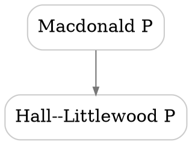

# Relation Posets Plan

This file plans how to turn `polydata` relation rows into posets and render them as SVG diagrams.

## Current Relation Data

Relations are encoded inside `polydata` blocks:

```tex
\begin{polydata}{macdonaldP}
  Name       & Macdonald P polynomials \\
  Space      & Sym \\
  Rating     & 4 \\
  Year       & 1987 \\
  Generalizes & hallLittlewoodP | Macdonald1987 \\
  Generalizes & jackP \\
  PositiveIn  & schur | SomeBibKey \\
\end{polydata}
```

Multiple rows with the same relation key are allowed. They accumulate:

```tex
  Generalizes & schur \\
  Generalizes & hallLittlewoodP | Macdonald1987 \\
  Generalizes & jackP \\
```

Multiple targets on one row are also allowed:

```tex
  Generalizes & schur; hallLittlewoodP | Macdonald1987; jackP \\
```

After `gather.lua` and `merge_meta.lua`, each relation appears in `temp/site-polydata.json` as:

```json
{
  "type": "generalizes",
  "label": "Generalizes",
  "target": "schur",
  "ref": "SomeBibKey"
}
```

The three canonical relation types are:

| TeX key | Internal type | Intended reading |
| --- | --- | --- |
| `Generalizes` | `generalizes` | source family generalizes target family |
| `Contains` | `contains` | source family contains target family as a subfamily/subcase |
| `PositiveIn` | `positive_in` | source family expands positively in target family |

The long keys from the first draft can remain aliases, but new data should prefer these shorter keys.

## Poset Semantics

Each relation type should be treated as a separate transitive relation. Do not merge the three types into one global poset by default, since the meanings are different.

For a relation item on family `A` with target `B`, create a directed relation:

```text
A --type--> B
```

Interpretation:

```text
A >=_type B
```

For `Generalizes` and `Contains`, this puts more general/larger families above more special/smaller families. For `PositiveIn`, this puts the family being expanded above the family used as the positive expansion basis/container. The SVG can show arrows downward from source to target, or omit arrowheads and rely on vertical order.

Because each relation type is transitive:

```text
A >= B and B >= C implies A >= C
```

The rendered diagram should be the Hasse diagram: show only cover relations, not every implied transitive edge.

## Core Algorithm

Create a Lua module/script, probably `polydata_posets.lua`, that reads `temp/site-polydata.json` and emits both machine-readable graph data and SVG files.

Inputs:

- `temp/site-polydata.json`
- optionally `temp/bibliography.json`, only if edge tooltips or reference labels are wanted

Outputs:

- `temp/site-posets.json`: normalized graph data for all relation types
- `assets/svg-images/poset-generalizes.svg`
- `assets/svg-images/poset-contains.svg`
- `assets/svg-images/poset-positive-in.svg`
- later, optional filtered SVGs such as `poset-generalizes-schur.svg`

Steps:

1. Load all polydata entries.
2. Build a node table keyed by polydata id, with display fields:
   - `id`
   - `Name`
   - `Space`
   - `Category`
   - `page`
   - `href`
3. Build an asserted edge list for each relation type:
   - `source`
   - `target`
   - `type`
   - `ref`
   - `asserted = true`
4. Validate edges:
   - target id exists
   - no self-loop unless explicitly allowed
   - no duplicate asserted edge with conflicting refs without warning
5. Detect cycles per relation type.
   - A cycle means the data is not a poset.
   - For a first implementation, fail the build on cycles.
   - Later, support alias components if we intentionally want equivalence classes.
6. Compute transitive closure per relation type.
   - Use DFS from each node; the graph is small enough.
   - Store closure for validation and future search/filtering.
7. Compute transitive reduction per relation type.
   - For each asserted or closure edge `A -> B`, remove it from the rendered edge set if there exists a path `A -> ... -> B` of length at least two.
   - The remaining edges are the Hasse cover relations.
8. Rank nodes.
   - Minimal simple rule: rank by longest path to a sink, so targets/specializations land lower.
   - Isolated nodes may be omitted by default or collected in a separate row.
9. Render SVG.

## SVG Rendering Strategy

Preferred first implementation: use Graphviz `dot` to produce SVG.

Reasons:

- Hasse diagrams are directed acyclic graphs; `dot` is good at layered DAG layout.
- It handles edge routing, text sizing, and rank constraints better than a quick custom renderer.
- The repo already has generated SVG assets and a build pipeline where another generated asset step is natural.

Tradeoff:

- Adds `dot`/Graphviz as a build dependency.

If avoiding a dependency becomes important, write a simple internal SVG renderer later:

- rank by longest path;
- group nodes by rank;
- order each rank alphabetically or by barycenter from adjacent ranks;
- draw straight or cubic edges;
- output pure SVG with text labels.

Graphviz DOT shape sketch:



SVG output from Graphviz preserves links with `href`/`URL` attributes depending on the Graphviz version. Verify the generated SVG links work after copying to `www/svg-images/`.

## Site Integration

There are two useful display modes.

### Static Index Diagrams

Add pages or sections that show the full posets:

```tex
\svgimg[width=0.95\textwidth]{svg-images/poset-generalizes.svg}{Generalization poset of polynomial families.}
```

These can live on `polynomialList.tex` or a new page such as `polynomialRelations.tex`.

### Dynamic Special Blocks

Later, add special blocks:

```tex
\specialblock{relationPoset:generalizes}
\specialblock{relationPoset:contains}
\specialblock{relationNeighborhood:macdonaldP}
```

This would require:

- extending `gather.lua` only if the specialblock syntax needs structured attributes;
- extending `render.lua` to turn these blocks into `` tags or inline SVG;
- generating filtered SVG assets during the build.

Start with static SVGs because they fit the current asset flow and are easy to cache.

## Build Pipeline Changes

Suggested files:

- `polydata_posets.lua`: build poset JSON, DOT, and SVG outputs
- `temp/site-posets.json`: generated closure/reduction data
- `temp/posets/*.dot`: generated Graphviz sources
- `assets/svg-images/poset-*.svg`: generated SVG assets, or use `temp` then copy to `www`

Makefile integration:

```make
.PHONY: posets
posets: $(TEMP_DIR)/site-polydata.json
	$(LUA) polydata_posets.lua
```

Then include `posets` before `copy-assets` if writing into `assets/svg-images`, or before `render` if pages depend on generated SVGs existing early.

Better long-term generated-file hygiene:

- write generated SVGs to `temp/generated-svg/`;
- copy them into `www/svg-images/` in `copy-assets`;
- avoid modifying tracked `assets/svg-images/` during a normal build.

That requires a slightly broader build change, so the first version may write to `assets/svg-images/` if that matches the existing `tex_to_svg.lua` pattern.

## References on Edges

Keep references attached to asserted edges.

For Hasse edges:

- If the cover edge is directly asserted, show its ref in a tooltip or small label.
- If the cover edge exists only because of transitive closure, it should normally not happen in a transitive reduction built from closure, but if it does after cycle/component handling, mark it as inferred and do not invent a reference.
- If several asserted refs support the same edge, preserve all refs as a comma-separated list.

Avoid rendering reference labels directly on the first SVG version unless the graph is tiny; edge labels can quickly make a poset unreadable.

## Validation Rules

The poset builder should print errors or warnings with enough context to fix the TeX source.

Errors:

- unknown relation target
- cycle in a relation type
- malformed relation record

Warnings:

- duplicate edge with different refs
- self-loop
- relation edge whose source or target has no display `Name`
- relation type exists in JSON but is not one of the known canonical types

## Implementation Checklist

1. Add `polydata_posets.lua`.
2. Implement loading and normalized edge extraction from `site-polydata.json`.
3. Add cycle detection and clear error messages.
4. Add transitive closure and transitive reduction.
5. Emit `temp/site-posets.json`.
6. Emit `.dot` files for `generalizes`, `contains`, and `positive_in`.
7. Call Graphviz `dot -Tsvg` to emit SVGs.
8. Add a Makefile `posets` target.
9. Add a TeX page/section that includes the generated SVGs.
10. Run a full build and verify:
    - SVG files exist;
    - links inside SVGs work;
    - diagrams are acyclic and readable;
    - redundant transitive edges are omitted.

## Open Decisions

- Should isolated nodes appear in full diagrams, or only nodes participating in at least one relation?
- Should `PositiveIn` be drawn in the same vertical orientation as `Generalizes`, or should it get its own visual grammar?
- Should cycles be fatal, or should strongly connected components be collapsed into equivalence classes?
- Should generated SVGs be tracked under `assets/svg-images/`, or generated into `www/svg-images/` only?
- Should a relation page include all three full posets, or should each relation type get its own page?
